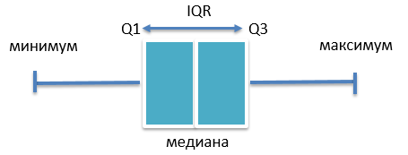

# Стат пакет в R

**Биостатистика** - это раздел статистики, который специализируется на сборе, анализе и интерпретации данных, связанных с биологическими и медицинскими исследованиями, используется для оценки различных аспектов здоровья, болезней, медицинских лечений и других биологических процессов.

С помощью методов биомедицинской статистики можно выявить закономерности, провести статистические тесты, оценить риски и сделать выводы на основе данных.

Биостатистический анализ представляет собой применение статистических методов к биологическим и медицинским данным. 

1. **Определите цели и сформулируйте гипотезы** перед началом анализа, что поможет выбрать правильные статистические методы.

2. **Выбор статистического метода** определяется взависимости от исходных данных и сформулированных гипотез**.**  

**Статистическая гипотеза** -- это предположение или утверждение о виде распределения и свойствах наблюдаемой выборки данных.

Статистические гипотезы бывают двух типов:

1. **Нулевая гипотеза (H0)** формулирует предположение о том, что никаких статистически значимых различий, эффектов или взаимосвязей в данных нет. H0 опровергается или отклоняется в ходе статистического анализа.

2. **Альтернативная гипотеза (H1)** подтверждает гипотетический эффект, различие или взаимосвязь. Если результаты анализа данных позволяют отклонить нулевую гипотезу, то принимается альтернативная гипотеза.

Примеры статистических гипотез:

H0: Средний возраст пациентов в двух группах одинаков.

H1: Средний возраст пациентов в двух группах различается.

H0: Нет корреляции между уровнем образования и доходом.

H1: Существует положительная корреляция между уровнем образования и доходом.

H0: Эффект нового лекарства на заболеваемость не отличается от плацебо.

H1: Новое лекарство снижает заболеваемость в большей степени, чем плацебо.

**Уровень статистической значимости** (альфа) - пороговое значение для отклонения нулевой гипотезы. В медицине принято выбирать альфа = 0,05 или альфа = 0,01, альфа = 0,001.

**Статистический критерий** -- это случайная величина, которая служит для проверки статистических гипотез.

Выбор статистических критериев зависит от **типа данных** в выборке и **характера распределения.**

Биомедицинские данные можно разделить на основные два типа: **количественные** **(непрерывные и дискретные)** и **качественные** **(номинальные и порядковые)** переменные.

1.  **Количественные переменные** (as.numeric(), as.integer()):

    -   Непрерывные переменные имеют бесконечное количество значений в заданном диапазоне и могут быть измерены с любой точностью. Примеры: возраст, вес, рост.

    -   Дискретные переменные имеют конечное или счетное количество значений и обычно представляют собой целые числа. Примеры: количество детей в семье, количество посещений врача в год.

2.  **Качественные переменные** (as.character(), as.factor()):

    -   Номинальные переменные представляют собой категории или метки, которые не имеют упорядоченного значения. Примеры: пол, цвет глаз, страна рождения.

    -   Порядковые переменные также представляют категории, но у них есть упорядоченное значение. Примеры: образование (среднее, высшее, магистратура), уровень удовлетворенности (низкий, средний, высокий).

*Проверить к какому типу относится переменная можно с помощью команды: class(таблица\$столбик).*

Для выбора метода анализа данных необходимо знать характер их распределения.

**Вероятность распределения** - это концепция в статистике, которая отражает вероятности различных значений или событий в рамках определенного статистического распределения. Вероятность описывает, насколько вероятно возникновение определенных результатов или значений в данном распределении.

Распределений существует большое количество, **однако для нас важно является ли распределение нормальным или отличным от нормального.**

**Алгоритм оценки распреденения:**

1. Постройте графики данных, чтобы визуально оценить их распределение. Наиболее распространенными графическими методами являются **гистограмма и QQ-график.** Графики помогут вам определить, к какому типу распределения данные могут быть ближе.

2. Используйте статистические тесты, такие как **тест Шапиро-Уилка или тест Колмогорова-Смирнова,** чтобы оценить, насколько данные соответствуют нормальному распределению. 

+-------------------------------+---------------------------------+
| выборка \< 50                 | выборка \> 50                   |
+===============================+=================================+
| *Критерий Шапиро-Уилка*       | *Критерий Колмогорова-Смирнова* |
|                               |                                 |
| shapiro.test()                | ks.test()                       |
+-------------------------------+---------------------------------+
| гистограмма, QQ-тест          | гистограмма, QQ-тест            |
|                               |                                 |
| geom_histogram + geom_density | geom_histogram + geom_density   |
|                               |                                 |
| stat_qq() + stat_qq_line      | stat_qq() + stat_qq_line        |
+-------------------------------+---------------------------------+

: **p-значение:** это вероятность получить наблюдаемые результаты при условии, что нулевая гипотеза верна. Низкое p-значение (\<0.05) приводит к отклонению нулевой гипотезы (Н0), принимается альтернативная гипотеза (Н1).

Если принимается нулевая гипотеза (H0), то для описания выборки используют **среднее значение и стандартное отклонение.**

В случае принятия альтернативной гипотезы (H1) вычисляется **медиана и стандартное отклонение.**

```{r,  message=FALSE, warning=FALSE, eval = FALSE}
Patient$height <- sample(120:170, 15, replace = TRUE) 
Patient$weight <- sample(60:75,15,replace = TRUE) 
Patient$age <- sample(30:39, 15,replace = TRUE) 
Patient <- data.frame(age = Patient$age,  
                 weight = Patient$weight, height = Patient$height)

Patient
```

*Примеры распределений (для справки):*

1.  *Нормальное распределение: Вероятность значений в нормальном распределении определяется кривой Гаусса, которая имеет пик вокруг среднего значения. Вероятность того, что случайная величина примет конкретное значение или попадет в интервал, можно вычислить с использованием функции плотности вероятности (PDF) или функции распределения (CDF).*

2.  *Биномиальное распределение: Это распределение используется для описания вероятностей успеха или неудачи в серии независимых экспериментов. Вероятность успешных и неуспешных исходов для заданного числа испытаний и вероятности успеха в каждом испытании определяются в биномиальном распределении.*

3.  *Равномерное распределение: Вероятности в равномерном распределении равномерно распределены в заданном диапазоне. Это означает, что все значения в диапазоне имеют одинаковую вероятность появления.*

4.  *Экспоненциальное распределение: Это распределение используется для моделирования времени между событиями. Вероятность того, что событие произойдет в определенный момент времени, уменьшается экспоненциально с увеличением времени.*

5.  *Гамма-распределение: Гамма-распределение используется для моделирования времени до наступления события, особенно в случаях, когда события происходят несколько раз.*

6.  *Пуассоновское распределение: Это распределение используется для описания числа событий, произошедших в фиксированном временном интервале или пространственной области.*

### **Количественные данные:**

+---------------+--------------------------+---------------------------------------+--------------------+
| группы        | нормальное распределение | отличное от нормального распределения | {ggplot2}          |
+---------------+--------------------------+---------------------------------------+--------------------+
| 2 независимые | t-test\                  | Тест Манна-Уитни\                     | диаграмма размаха\ |
|               | t.test(paired =  FALSE)  | wilcox.test(paired =  FALSE)          | geom_boxplot()     |
+---------------+--------------------------+---------------------------------------+--------------------+
| 2 связанные   | t-test\                  | Критерий Уилкоксона\                  | диаграмма размаха\ |
|               | t.test(paired =  TRUE)   | wilcox.test(paired =  TRUE            | geom_bar()         |
+---------------+--------------------------+---------------------------------------+--------------------+

### Качественные данные:

+---------------+------------------------------------+---------------------------------+
| группы        | нормальное распределение           | {ggplot2}                       |
+---------------+------------------------------------+---------------------------------+
| 2 независимые | Критерий хи-квадрат chisq.test()   | столбчатая диаграмма geom_bar() |
|               |                                    |                                 |
|               | Критерий Фишера                    |                                 |
+---------------+------------------------------------+---------------------------------+
| 2 связанные   | Критерий Мак-Немара mcnemar.test() | столбчатая диаграмма geom_bar() |
+---------------+------------------------------------+---------------------------------+

**Нормальность распределения:**

+-------------------------------+-------------------------------+
| выборка \< 50                 | выборка \> 50                 |
+-------------------------------+-------------------------------+
| Критерий Шапиро-Уилка         | Критерий Колмогорова-Смирнова |
|                               |                               |
| shapiro.test()                | ks.test()                     |
+-------------------------------+-------------------------------+
| гистограмма, QQ-тест          | гистограмма, QQ-тест          |
|                               |                               |
| geom_histogram + geom_density | geom_histogram + geom_density |
|                               |                               |
| stat_qq() + stat_qq_line      | stat_qq() + stat_qq_line      |
+-------------------------------+-------------------------------+

В R есть несколько встроенных наборов данных. Эти наборы данных полезны для практики в построении моделей, визуализации и других операциях с данными.

*Пример*: Даны данные длины зубов у 60 морских свинок (**ToothGrowth**). Всем свинкам давали витамин С в виде апельсинового сока или аскорбиновой кислоты. Каждое животное получало одну их 3х доз витамина С (0.5, 1 или 2 мг/сут). Рассмотрим влияние витамина С на рост зубов у морских свинок.

```{r}
# Загрузка данных
data <- ToothGrowth
data1 <- subset(data,supp=="VC")
data2 <- subset(data,supp=="OJ")
shapiro.test(data1$len)
```

```{r}
# Загрузка данных
data <- ToothGrowth
data2 <- subset(data,supp=="OJ")
shapiro.test(data2$len)

```

|                        |              |               |
|------------------------|--------------|---------------|
|                        | VC           | OJ            |
| p-value                | 0.43 \> 0.05 | 0.024 \< 0.05 |
| среднее значение       | 16.96        |               |
| стандартное отклонение | 8.27         |               |
| медиана                |              | 22.7          |
| квартили               |              | 15.53; 25.73  |

```{r}
# Загрузка данных
data <- ToothGrowth
data1 <- subset(data,supp=="VC")
data2 <- subset(data,supp=="OJ")
result_norm1 <- shapiro.test(data1$len)
result_norm2 <- shapiro.test(data2$len)

test_1 <- function(x1,x2) {
if (x2 > 0.05) {
    cat('mean = ',mean(x1))
    cat("\n")
    cat('sd = ', sd(x1))
    cat("\n")
    } else {
    cat('median = ', median(x1))
    cat("\n")
    cat('quant = ', quantile(x1))
    cat("\n")
  }
}
test_1(data1$len,result_norm1$p.value)
test_1(data2$len,result_norm2$p.value) 
```

# Статистические критерии

**t-test()**

**Т-критерий Стьюдента, или t-тест**, является статистическим методом, используемым для определения статистически значимых различий между средними значениями двух групп.



 

**Статистически критерий** -- это случайная величина, которая служит для проверки статистических гипотез.

Выбор статистических критериев зависит от типа данных в выборке и характера распределения.

```{r,  message=FALSE, warning=FALSE, eval = FALSE}
# Для установки основных пакетов
install.packages("BiocManager") 
if (!requireNamespace("BiocManager", quietly = TRUE))

# Bioconductor введите: BiocManager::install("edgeR") или необходимо

install.packages("BiocManager") 
BiocManager::install("имя_пакета")

```
